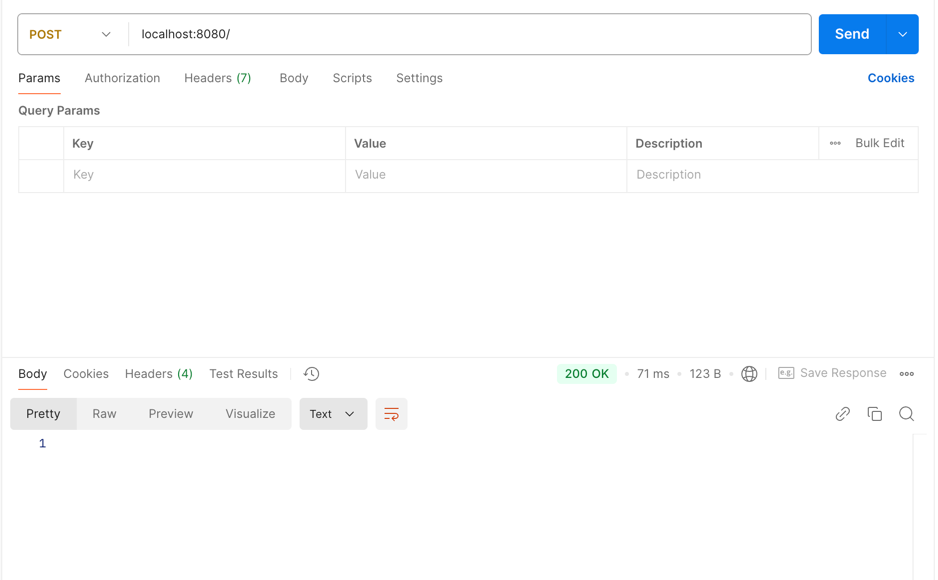
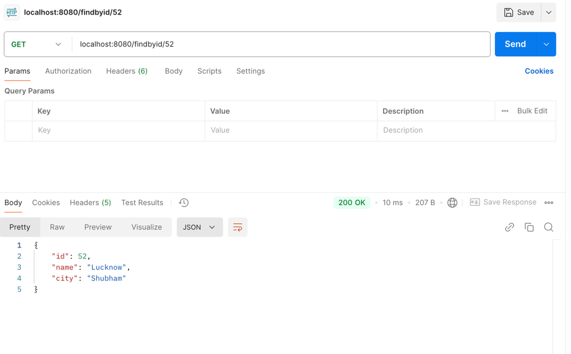
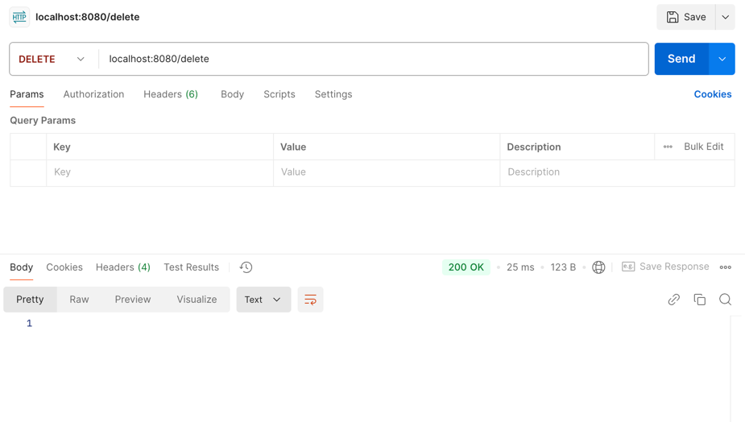
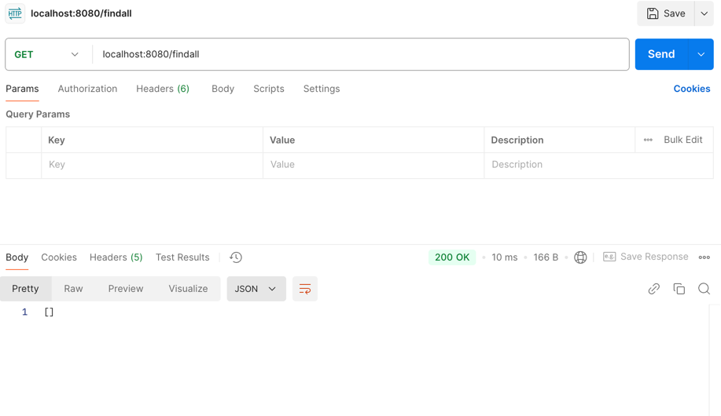

# Spring-Boot-Spring-Data-JPA
#### Họ và tên sinh viên: Nguyễn Trung Nguyên 22024553
>ORM (Object Relational Mapping) là quá trình lưu trữ đối tượng Java vào bảng cơ sở dữ liệu, trong đó tên đối tượng là tên bảng và các trường của đối tượng là các cột trong bảng. Hibernate là một ví dụ về ORM.

Java Persistence API (JPA) là một giao diện định nghĩa các quy tắc để lưu trữ và quản lý dữ liệu giữa đối tượng Java và cơ sở dữ liệu quan hệ. JPA không thực thi mã mà chỉ cung cấp hướng dẫn triển khai ORM. Hibernate là một triển khai phổ biến của JPA.

Spring Data JPA là một phần của Spring Framework, cung cấp lớp trừu tượng giúp giảm mã mẫu khi truy cập dữ liệu từ các kho lưu trữ, nhưng không phải là nhà cung cấp JPA mà chỉ bổ sung lớp trừu tượng trên Hibernate hoặc các nhà cung cấp JPA khác.

### Thêm nhân viên

### Xem toàn bộ nhân viên - Các nhân viên được thêm đã được cập nhật

### Tìm kiếm nhân viên theo id

### Xóa toàn bộ nhân viên

### Kết quả xóa đã được cập nhật thành công
